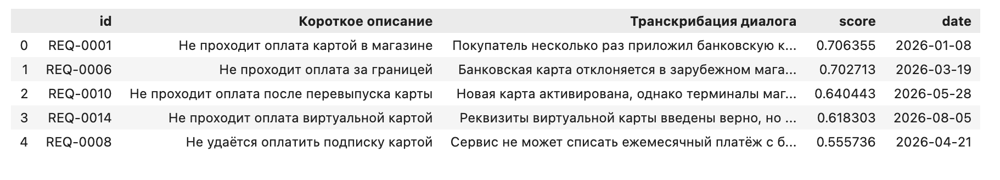

# Гибридный поиск по обращениям

Учебный проект гибридного поиска по текстовым обращениям. Решение объединяет SentenceTransformer-эмбеддинги, FAISS IVFPQ, лексический поиск BM25S, Reciprocal Rank Fusion и CrossEncoder-реранкинг.

## Структура проекта

```text
faiss_bm25_d3/
├── data/
│   ├── rag_documents_all.parquet
│   └── rag_documents_new.parquet
├── cache_le_finale2/       # мета, memmap, FAISS и BM25S-шарды
├── pipeline_train.ipynb    # построение и обновление индексов
├── pipeline_search.ipynb   # гибридный поиск и реранкинг
├── requirements.txt
└── README.md
```

Все пути в Notebook задаются относительно корня проекта.

## Входные данные

Проект работает с двумя заранее подготовленными Parquet-наборами:

- `data/rag_documents_all.parquet` — полный корпус для первоначального построения индексов;
- `data/rag_documents_new.parquet` — новые документы для инкрементального обновления.

Оба набора содержат следующие поля:

| Поле | Назначение | Пример |
|---|---|---|
| `id` | уникальный идентификатор обращения | `REQ-001` |
| `req_desc` | краткое описание темы обращения | `Не проходит оплата` |
| `msg_pprb_chat` | полный текст диалога с пользователем | `Клиент сообщает, что платёж отклонён` |
| `req_reg_date` | дата регистрации обращения | `2026-01-15` |

## Синтетический демонстрационный датасет

В `data/rag_documents_all.parquet` добавлен синтетический набор из 100 обращений по банковским продуктам, маркетплейсам, такси, доставке, связи, путешествиям, страхованию, цифровым сервисам, образованию и ЖКХ.

В демонстрационном поиске используется запрос `не проходит оплата банковской картой`, фильтр по датам с `2026-01-01` по `2026-12-31` и вывод пяти результатов.

### Результаты демонстрационного запуска



## Архитектура

```text
                 ОБУЧЕНИЕ И ПОСТРОЕНИЕ ИНДЕКСОВ

                    Данные в формате Parquet
                               │
              ┌────────────────┴────────────────┐
              │                                 │
Построение эмбеддингов через BGE-M3       токенизация
              ↓                                 ↓
       эмбеддинги батчами                 BM25S-шарды
              ↓
            memmap
              ↓
          FAISS IVFPQ

                             ПОИСК

                  пользовательский запрос
                               ↓
                    фильтрация по датам
                               ↓
              ┌────────────────┴────────────────┐
              │                                 │
       поиск по FAISS                    поиск по BM25S
              ↓                                 ↓
       кандидаты FAISS                    кандидаты BM25S
              └────────────────┬────────────────┘
                               ↓
                  слияние оценок через RRF
                               ↓
                    CrossEncoder-реранкинг
                               ↓
              итоговая таблица релевантных ответов
```

`pipeline_train.ipynb` объединяет `req_desc` и `msg_pprb_chat`, токенизирует документы, создаёт нормализованные эмбеддинги батчами с помощью SentenceTransformer (BGE-M3) и записывает их в `memmap`. Векторы индексируются через FAISS IVFPQ, а токены — отдельными BM25S-шардами.

FAISS IVFPQ — кластеризованный приближённый индекс: он группирует близкие векторы в кластеры и ускоряет поиск по большому корпусу, проверяя только релевантные области индекса. Пользовательский запрос одновременно обрабатывается FAISS и BM25S, после чего оценки объединяются через RRF (Reciprocal Rank Fusion) по рангам кандидатов. На этапе отбора система получает до 2048 кандидатов из FAISS и до 1372 из BM25S (фактическое число зависит от размера корпуса). Пользователь может выбрать количество ответов (`top_k`) и указать временной диапазон по `req_reg_date`.

`pipeline_search.ipynb` загружает полную мету, FAISS и BM25S-шарды, получает кандидатов, применяет фильтр по `req_reg_date`, объединяет ранги через RRF и выполняет CrossEncoder-реранкинг.

Полная мета содержит:

- `documents`;
- `doc_ids`;
- `req_descs`;
- `msg_pprb_chats`;
- `req_reg_dates`;
- `tokenized_corpus`;
- `id_to_index`.

## Установка

Рекомендуется Python 3.10–3.12.

```bash
python3 -m venv .venv
source .venv/bin/activate
python -m pip install --upgrade pip
python -m pip install -r requirements.txt
jupyter notebook
```

В `requirements.txt` указана CPU-версия FAISS. Для GPU удалите её и установите сборку, совместимую с вашей ОС, CUDA и драйвером:

```bash
python -m pip uninstall faiss-cpu
python -m pip install faiss-gpu-cu12
```

## Модели

По умолчанию используются публичные модели Hugging Face:

```text
BAAI/bge-m3
BAAI/bge-reranker-v2-m3
```

При выполнении модельных ячеек `SentenceTransformer` и `CrossEncoder` автоматически загрузят модели. Для offline-сценария укажите локальные каталоги:

```bash
export EMBEDDING_MODEL_NAME=/path/to/bge-m3
export RERANKER_MODEL_NAME=/path/to/bge-reranker-v2-m3
```

Одна и та же embedding-модель должна использоваться при построении индекса и поиске.

## Порядок запуска

### 1. Построение или обновление индексов

Откройте `pipeline_train.ipynb`. Поддерживаются три сценария:

- вариант A (`initial`) — первично строит все индексы по полному Parquet. Используйте при отсутствии готового кэша или создании базы с нуля;
- вариант B (`add`) — добавляет новые документы через `index.add` без переобучения FAISS. Подходит для небольших обновлений при сохранении тематики;
- вариант C (`rebuild`) — добавляет новые документы и полностью переобучает FAISS. Используйте при существенном росте корпуса или изменении тематики.

Выберите нужный режим в параметре `mode` и запустите ячейку.

### 2. Поиск

Откройте `pipeline_search.ipynb`, загрузите полную мету, BM25S-шарды и FAISS, затем выполните запрос:

```python
res = search_pipeline(
    query="обращения по ипотеке по графикам платежей",
    faiss_idx=faiss_loaded,
    bm25_indexes=bm25_indexes,
    top_k=10,
    date_range=("2026-01-01", "9999-12-31"),
)
```

Результат — `pandas.DataFrame` со столбцами `id`, `Короткое описание`, `Транскрибация диалога`, `score` и `date`. Он сохраняется в `results.csv` в корне проекта.

## Масштабирование

- BM25S хранится шардами: перестраивается последний неполный шард, а новые добавляются по мере роста корпуса.
- Поиск по BM25S-шардам можно распараллелить.
- FAISS IVFPQ сокращает расход памяти; `nlist`, `nprobe`, обучающая выборка и параметры PQ задают компромисс между скоростью и полнотой.
- Эмбеддинги создаются батчами, а `memmap` позволяет не держать весь массив в RAM.
- Новые документы добавляются через `index.add`; полное переобучение требуется при существенном росте корпуса или изменении тематики.
- CrossEncoder является наиболее тяжёлой online-стадией и может масштабироваться отдельно.
